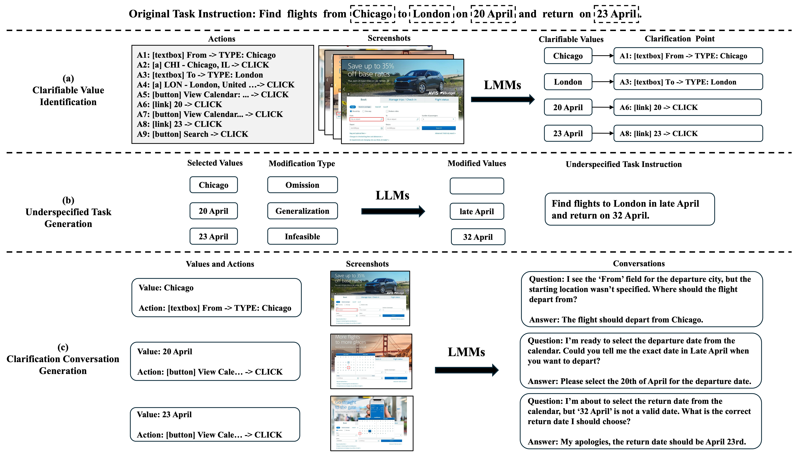

# Proactive Web Agents with Interactive Multimodal Clarification

<a href="https://ymwangv.github.io/">Yingming Wang</a> · 
<a href="https://yfyuan01.github.io/">Yifei Yuan</a> · 
<a href="https://anderssoegaard.github.io/">Anders Søgaard</a> · 
<a href="https://dengyang17.github.io/">Yang Deng</a>

---

## 🤗 Dataset

<h4 align="center"><a href="https://huggingface.co/datasets/ymwangv/MC-Mind2Web" style="color: #FF0000;">https://huggingface.co/datasets/ymwangv/MC-Mind2Web</a></h4>

---

## 📋 Overview

Web agents powered by large language models (LLMs) and large multimodal models (LMMs) have demonstrated remarkable abilities in fulfilling user tasks through step-by-step planning and execution over the multimodal web environment. However, their effectiveness is limited in existing benchmarks: user instructions are assumed fully-specified and executable. In real-world scenarios, instructions are often underspecified, leaving agents unable to proceed without first seeking clarification from the user. To address this gap, we introduce **Multimodal Proactive Web Navigation**, a new task that requires an agent to identify underspecified details that prevent task completion, ask clarification questions to resolve these issues, and only then proceed with planning and execution. We present the **Multimodal Clarification Mind2Web (MC-Mind2Web)** dataset, constructed from a text-only dataset Mind2Web. To benchmark the task, we propose **ProAct**, a dual-agent pipeline where a clarification agent detects the clarification need and asks clarification questions, while a navigation agent handles subsequent planning and execution based on the clarification results. Comprehensive experiments on MC-Mind2Web reveal the challenges of this problem.

  

